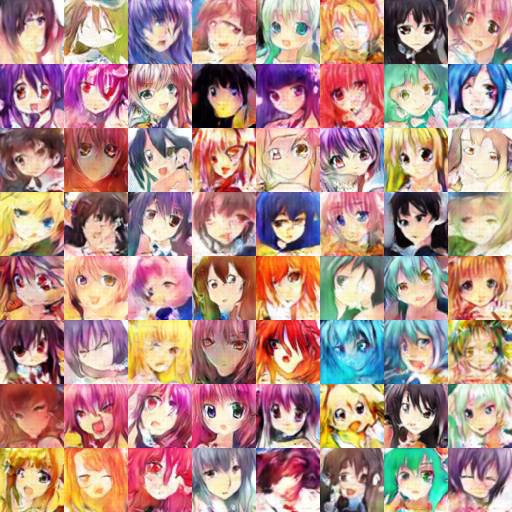

# DCGAN on Animation Dataset
The code is based on the [github repo of Carpedm20](https://github.com/carpedm20/DCGAN-tensorflow). I trained the model on the animation dataset as described in the [Zhihu post](https://zhuanlan.zhihu.com/p/24767059).

### Dataset
I've download the dataset and placed it under the directory: `/home/jesse_xie/download/faces-anime.zip` on the fit server. Just unzip it to the data directory for training.

### train command
Because of the update of the Carpedm20's original code, the train command given in the the [Zhihu post](https://zhuanlan.zhihu.com/p/24767059):

```bash
python main.py --image_size 96 --output_size 48 --dataset anime --is_crop True --is_train True --epoch 300 --input_fname_pattern "*.jpg"
```

should be modified to:

```bash
python main.py --input_height 96 --output_height 48 --dataset anime --is_crop True --is_train True --epoch 300 --input_fname_pattern "*.jpg"
```

Once you've trained the model, and want to use it to do other experiments, you can run the above command with option `--is_train False`

### my experiments
First, I trained the network on the animation dataset for 60 epoches. As the trainning goes on, severe mode collapse are observed.

Epoch 20:


Epoch 40



Epoch 60


I've carried out two other experiment so far, but the result is far from satisfactory. 

1. Project the x to the latent space directly by solving the optimizing problem: find z to minimize MSE(G(z), x). This is implemented by the function `project_x_to_z` in file `experiment.py`
2. Poject a sketch to latent space using a neural network. This is implemented by the class `Sketch2Image` in file `experiment.py` 

See `work.md` for more information.


### Notes
+ run it use python instead of ipython(core dumped very often, unkown cause)
